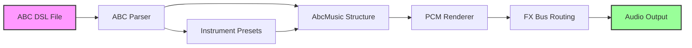
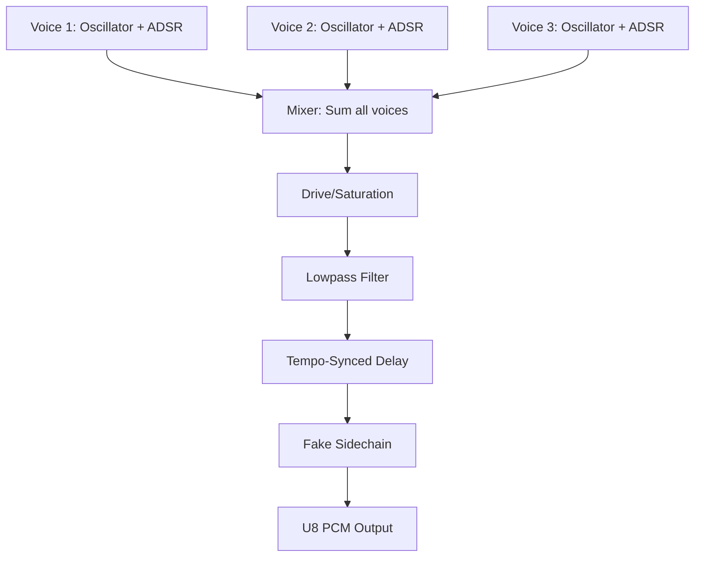

# ABC DSL - Extended Notation for Synth Composition

This document describes the extended ABC notation dialect used by MemDeck for dark synth and synth disco music composition.

## Overview

MemDeck extends standard ABC notation with custom directives to control:
- **Instruments**: Named presets with ADSR envelopes, waveforms, modulation, and FX routing
- **Effects**: Multiple independent FX buses with delay, drive, lowpass filtering, sidechain ducking
- **Timing**: Swing, tempo, note gates
- **Structure**: Patterns and arrangements (basic parsing implemented, full timeline rendering planned)

## Architecture



## Standard ABC Notation

MemDeck supports the following standard ABC features:

### Header Fields

- **X:** Reference number (ignored)
- **T:** Title
- **C:** Composer (optional)
- **M:** Meter (time signature), e.g., `M:4/4`
- **L:** Default note length, e.g., `L:1/16` (sixteenth note)
- **Q:** Tempo in BPM, e.g., `Q:1/4=126` (126 quarter notes per minute)
- **K:** Key signature, e.g., `K:Dm` (D minor)

### Voice Definitions

```abc
V:bass amp=80
V:lead amp=50 wave=triangle
```

Each voice creates an independent track with its own instrument settings.

### Notes and Rhythm

- **Notes**: `C D E F G A B` (octave 4), `c d e f g a b` (octave 5)
- **Octave modifiers**: `,` (down one octave), `'` (up one octave)
- **Accidentals**: `^` (sharp), `_` (flat), `=` (natural)
- **Rests**: `z` (rest)
- **Duration**: Number after note, e.g., `C2` (twice default length)
- **Barlines**: `|` (bar), `|:` (repeat start), `:|` (repeat end)

Example:
```abc
|: D4E4 F4G4 | A4z4 _B4A4 :|
```

## Extended Directives

### Voice Instrument Parameters

Control waveform, amplitude, and ADSR envelope per voice:

```abc
V:bass amp=80 wave=pulse duty=35 attack=2 decay=40 sustain=70 release=80 gate=75 vibrato=5 glide=10
```

**Parameters:**

| Parameter | Range | Default | Description |
|-----------|-------|---------|-------------|
| `amp` | 0-127 | 40 | Voice amplitude (volume) |
| `wave` | square/pulse/triangle/noise | square | Oscillator waveform |
| `duty` | 1-99 | 25 | Pulse width percentage (pulse wave only) |
| `attack` | 0-1000 (ms) | 0 | ADSR attack time |
| `decay` | 0-1000 (ms) | 0 | ADSR decay time |
| `sustain` | 0-100 (%) | 100 | ADSR sustain level |
| `release` | 0-2000 (ms) | 0 | ADSR release time |
| `gate` | 1-100 (%) | 90 | Note gate (percentage of step duration) |
| `vibrato` | 0-100 (cents) | 0 | Vibrato depth in cents |
| `glide` | 0-500 (ms) | 0 | Portamento/glide time between notes |

**Special modifiers:**
- `staccato`: Shorthand for `gate=75`

**Validation:**
- Invalid waveform names fall back to `square` with a warning
- Amplitude out of range (0-127) triggers a warning and uses default
- Duty cycle out of range (1-99) triggers a warning and uses default

### Effect Directives

#### %%effect - Delay/Drive/Lowpass

Configure FX processing applied to all voices:

```abc
%%effect delay time=3 feedback=35 mix=25
%%effect drive amount=20
%%effect lowpass amount=30
```

**Parameters:**

| Directive | Parameter | Range | Default | Description |
|-----------|-----------|-------|---------|-------------|
| `delay` | `time` | 0-16 (steps) | 0 | Delay time in sequencer steps |
| | `feedback` | 0-100 (%) | 0 | Delay feedback percentage |
| | `mix` | 0-100 (%) | 0 | Delay wet/dry mix |
| `drive` | `amount` | 0-100 (%) | 0 | Saturation/overdrive amount |
| `lowpass` | `amount` | 0-100 (%) | 0 | Lowpass filter cutoff attenuation |

#### %%sidechain - Ducking Effect

Accent-triggered fake sidechain compression:

```abc
%%sidechain amount=40 release=180
```

**Parameters:**

| Parameter | Range | Default | Description |
|-----------|-------|---------|-------------|
| `amount` | 0-100 (%) | 0 | Sidechain ducking amount |
| `release` | 0-1000 (ms) | 180 | Sidechain release time |

### %%swing - Timing Adjustment

Add swing/shuffle to the rhythm:

```abc
%%swing 56
```

**Parameters:**

| Parameter | Range | Default | Description |
|-----------|-------|---------|-------------|
| swing value | 0-100 (%) | 0 | Swing percentage (50=straight, 67=triplet feel) |

Higher values delay even-numbered steps, creating a shuffle feel.

## Signal Flow



## FX Processing Order

Effects are applied in a fixed order:
1. **Drive** - Pre-gain and soft saturation
2. **Lowpass** - One-pole lowpass filter
3. **Delay** - Tempo-synced with feedback
4. **Sidechain** - Accent-triggered ducking

## Examples

### Basic Dark Synth Bass

```abc
X:1
T:Dark Bass Example
M:4/4
L:1/16
Q:1/4=126
K:Dm
V:bass amp=80 wave=pulse duty=35 attack=2 decay=40 sustain=70 release=80 gate=75
V:bass
|: D,,4D,,4 D,,4D,,4 | D,,4D,,4 D,,4D,,4 :|
```

### Arpeggio with Vibrato

```abc
X:1
T:Arp Example
M:4/4
L:1/16
Q:1/4=140
K:Am
V:arp amp=45 wave=pulse duty=20 attack=0 decay=20 sustain=60 release=40 gate=45 vibrato=8
V:arp
|: ACE=a ACE=a ACE=a ACE=a :|
```

### Pad with Effects

```abc
X:1
T:Synth Pad
M:4/4
L:1/16
Q:1/4=110
K:Em
%%effect delay time=5 feedback=40 mix=20
%%effect lowpass amount=35
V:pad amp=40 wave=triangle attack=120 decay=160 sustain=85 release=400 gate=98
V:pad
|: E8z8 | z16 :|
```

### Full Dark Synth Track

```abc
X:1
T:Complete Dark Synth
M:4/4
L:1/16
Q:1/4=126
K:Dm
%%swing 56
%%effect delay time=3 feedback=35 mix=25
%%effect drive amount=20
%%effect lowpass amount=30
%%sidechain amount=40 release=180
%%staves [bass arp lead]
V:bass amp=80 wave=pulse duty=35 attack=2 decay=40 sustain=70 release=80 gate=75
V:arp amp=45 wave=pulse duty=20 attack=0 decay=20 sustain=60 release=40 gate=45 vibrato=5
V:lead amp=50 wave=triangle attack=80 decay=120 sustain=80 release=300 gate=95
%
V:bass
|: D,,4D,,4 D,,4D,,4 | _B,,4_B,,4 A,,4A,,4 :|
V:arp
|: DFA=c DFA=c DFA=c DFA=c | _BDF_b _BDF_b ACE=a ACE=a :|
V:lead
|: z16 | =c=c4z4 z8 :|
```

## Advanced Features

### %%instrument - Named Instrument Presets

Define reusable instrument presets with complete parameter sets:

```abc
%%instrument bass preset=heavy_bass wave=pulse amp=85 duty=40 attack=1 decay=50 sustain=75 release=100 gate=70 fx=0
%%instrument arp preset=plucky_arp wave=pulse amp=50 duty=25 attack=0 decay=20 sustain=60 release=40 gate=45 vibrato=6 fx=1
%%instrument pad preset=soft_pad wave=triangle amp=35 attack=120 decay=160 sustain=85 release=400 gate=98 fx=1
```

Then reference instruments in voice definitions:

```abc
V:bass instrument=bass
V:arp instrument=arp
V:pad instrument=pad
```

**Parameters:**

| Parameter | Range | Default | Description |
|-----------|-------|---------|-------------|
| `preset` | string | - | Preset identifier for documentation |
| `wave` | square/pulse/triangle/noise | square | Oscillator waveform |
| `amp` | 0-127 | 40 | Amplitude (MIDI range) |
| `duty` | 1-99 | 25 | Pulse width percentage |
| `attack` | 0-1000 (ms) | 0 | ADSR attack time |
| `decay` | 0-1000 (ms) | 0 | ADSR decay time |
| `sustain` | 0-100 (%) | 100 | ADSR sustain level |
| `release` | 0-2000 (ms) | 0 | ADSR release time |
| `gate` | 1-100 (%) | 90 | Note gate percentage |
| `vibrato` | 0-100 (cents) | 0 | Vibrato depth |
| `glide` | 0-500 (ms) | 0 | Portamento time |
| `fx` | 0-3 | 0 | FX bus routing |

Voice parameters override instrument defaults. This allows creating variations on a preset.

### %%effect - Numbered FX Buses

Configure multiple independent FX buses for routing different voices to different effects chains:

```abc
%%effect 0 delay_steps=3 delay_feedback=35 delay_mix=25 drive=25 lowpass=30 sidechain=45 sidechain_release=180 mix=85
%%effect 1 delay_steps=6 delay_feedback=45 delay_mix=35 drive=10 lowpass=55 mix=70
```

**Parameters:**

| Parameter | Range | Default | Description |
|-----------|-------|---------|-------------|
| `delay_steps` | 0-16 | 0 | Delay time in sequencer steps |
| `delay_feedback` | 0-100 (%) | 0 | Delay feedback |
| `delay_mix` | 0-100 (%) | 0 | Delay wet/dry mix |
| `drive` | 0-100 (%) | 0 | Saturation amount |
| `lowpass` | 0-100 (%) | 0 | Lowpass filter attenuation |
| `sidechain` | 0-100 (%) | 0 | Sidechain ducking amount |
| `sidechain_release` | 0-1000 (ms) | 180 | Sidechain release time |
| `mix` | 1-100 (%) | 100 | Bus output mix level |

**Routing:**

Route voices/instruments to buses using `fx=N` parameter:

```abc
%%instrument dry_bass wave=pulse amp=90 fx=0
%%instrument wet_synth wave=pulse amp=45 fx=1
```

Or in voice directives:

```abc
V:bass amp=80 fx=0
V:lead amp=50 fx=1
```

**Backward Compatibility:**

Legacy single-bus directives still work:

```abc
%%effect delay time=3 feedback=35 mix=25
%%effect drive amount=20
%%effect lowpass amount=30
```

These map to bus 0 automatically.

### %%pattern and %%arrangement - Pattern-Based Composition

**Status:** Structure parsing implemented; timeline rendering planned for future release.

Define reusable patterns:

```abc
%%pattern A length=16
%%pattern B length=16
%%arrangement A A B A
```

This will enable efficient composition of longer tracks with repeating sections.

## Future Features

The following features are planned but not yet fully implemented:

### Pattern-Based Note Input

Currently patterns store metadata but don't yet capture note sequences. Future implementation will allow:

```abc
%%pattern intro length=16
%%pattern verse length=32  
%%pattern chorus length=16
%%arrangement intro verse chorus verse chorus

V:bass pattern=intro
|: D,,4D,,4 D,,4D,,4 | ... :|

V:bass pattern=verse
|: A,,4A,,4 A,,4A,,4 | ... :|
```

### Multi-Bus FX Rendering

Currently all voices render through a single FX chain (bus 0), even though multiple buses can be configured. Future implementation will route each voice through its assigned FX bus independently.

## Backward Compatibility

All existing ABC files without extended directives continue to work unchanged. Unsupported directives are safely ignored.

## Constraints

- **Portable**: Pure C99, no platform-specific code
- **WASM-compatible**: Runs in browsers via WebAssembly
- **Deterministic**: Same input always produces identical PCM output
- **Retro**: Maintains chiptune/8-bit aesthetic
- **Lightweight**: No external audio libraries

## See Also

- [Audio Architecture](audio-architecture.md) - System architecture overview
- [Audio Instruments](audio-instruments.md) - Instrument presets and ADSR
- [Audio FX](audio-fx.md) - FX bus parameters and configuration
