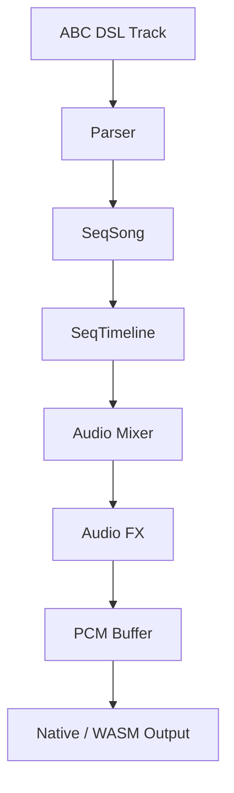

# Audio Architecture

MemDeck audio is a single deterministic path:

1. Parse ABC DSL (`src/abc.c`)
2. Build `SeqSong`
3. Compile `SeqTimeline` (`src/audio_seq.c`)
4. Render and mix (`src/audio_mix.c`)
5. Apply FX buses (`src/audio_fx.c`)
6. Emit PCM to backend (`src/sound.c`)

## Modules

- `src/abc.c`: ABC parsing + ABC->SeqSong conversion
- `src/audio_seq.c/.h`: timeline compilation and note event collection
- `src/audio_mix.c/.h`: oscillator/envelope rendering and summing
- `src/audio_fx.c/.h`: delay, drive, one-pole low-pass, fake sidechain
- `src/sound.c`: output backend orchestration

## FX bus model

`SeqFxBus` fields used by the mixer:

- `enabled`
- `delay_steps`
- `delay_feedback`
- `delay_mix`
- `drive_amount`
- `lowpass_amount`
- `sidechain_amount`
- `sidechain_release_ms`
- `mix_percent`
