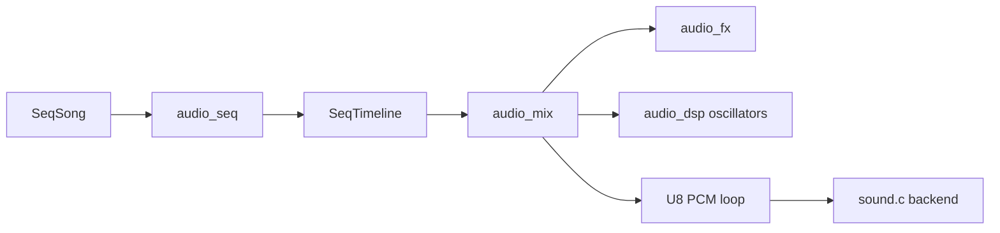
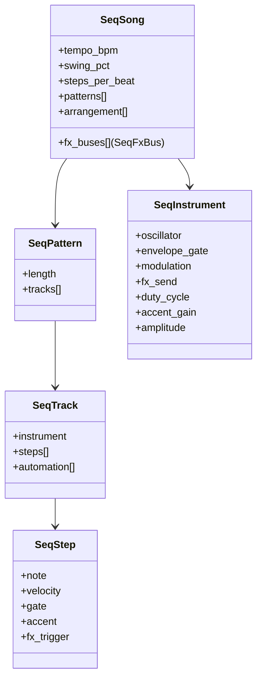
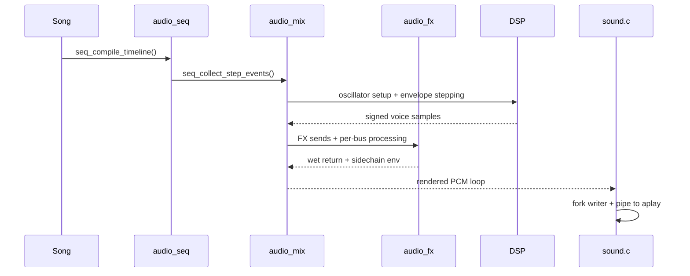

# Audio architecture notes

## Goals
- Keep portable C99/C11 code for Linux + Emscripten.
- Keep retro/chiptune character (square/pulse-centric voices).
- Keep deterministic timing and predictable buffers.
- Separate sequencing, mixing, DSP, and output backend concerns.

## Layered structure
- `src/audio_song_builtin.c` = built-in retro song definitions using reusable song/pattern/track/step data.
- `src/audio_seq.c/.h` = portable sequencing layer with arrangement expansion, pattern chaining, tempo timing, swing, and note-event emission.
- `src/audio_mix.c/.h` = portable PCM renderer that consumes sequencer note events with instrument + envelope + modulation state plus FX bus routing.
- `src/audio_fx.c/.h` = deterministic FX processing primitives (delay, drive, low-pass, fake sidechain).
- `src/audio_dsp.c/.h` = low-level oscillator/timing/profile primitives.
- `src/abc.c` = ABC parsing + ABC-specific render path.
- `src/sound.c` = native output backend (`fork`, `pipe`, `aplay`) and SFX orchestration.

## Song model

## Sequencing model
- Arrangement order is expanded into a `SeqTimeline`.
- Pattern chaining is driven by `song->arrangement[]`, so built-in music is no longer hardwired to a single loop implementation in `sound.c`.
- Step timing is generated from BPM + step resolution with integer remainder carry, which keeps total samples stable across long loops.
- Swing is applied as an alternating long/short step pair while preserving pair duration.
- Track automation is intentionally lightweight: per-step signed gain offsets only.

## Mixing model
- Mono U8 PCM centered at 128.
- Mixer tracks own lightweight voice slots, enabling release tails and overlapping notes.
- Voices render with `DspOscillator` + `DspEnvelopeRuntime` per sample.
- Optional modulation is applied in the mixer: vibrato, PWM, detune stack, glide.
- Velocity, gate, accent, and per-track automation shape note output before sample summing.
- FX buses run in this order: drive -> low-pass -> delay -> fake sidechain.
- Delay is tempo-synced from song timing (steps), with deterministic circular buffer behavior.
- Fake sidechain applies tempo-aware ducking envelope to create pumping without realtime compression.

## Output/backend split
- `sound_success()` / `sound_fail()` remain backend-triggered SFX.
- `sound_music_start()` now only chooses a source, renders/loads PCM, and streams it.
- The built-in fallback path is portable until the final backend handoff.
- WASM builds continue to exclude `sound.c`; the sequencer and mixer stay portable C and can be reused by a future WASM audio backend.

## Verification
- Native verification chain remains:
  - `make clean`
  - `make all`
  - `make test`
  - `make test-audio-seq`
  - `make bench-audio`
- WASM verification now includes:
  - `make -C wasm verify`
  - `node wasm/verify-audio.js`
  - `make -C wasm`
