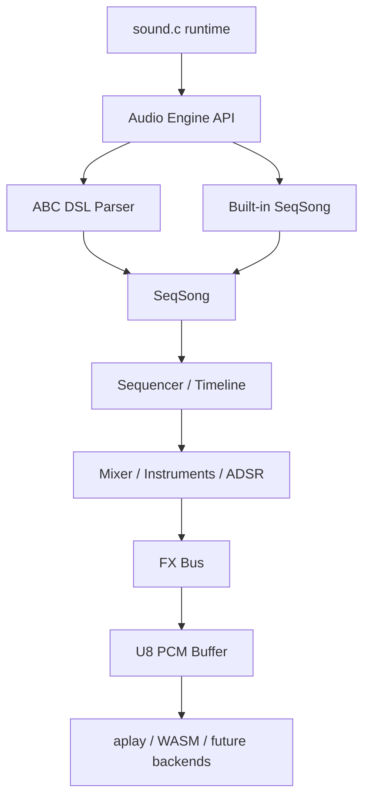

# Audio Architecture

MemDeck now renders built-in songs and ABC tracks through the same portable engine path.

## Public API

Declared in `src/memdeck.h`:

- `audio_engine_render_builtin_menu()`
- `audio_engine_render_abc_file()`
- `audio_engine_render_song()`
- `audio_engine_free_buffer()`

All render functions return a heap-allocated U8 PCM buffer on success and `NULL` on failure. The caller owns the returned buffer and must release it with `audio_engine_free_buffer()`.

## Data flow

## Modules

- `src/audio_engine.c`: stable render entry points, ownership rules, render statistics
- `src/abc.c`: ABC parsing, DSL validation, legacy ABC compatibility, `AbcMusic -> SeqSong`
- `src/audio_song_builtin.c`: built-in menu `SeqSong`
- `src/audio_seq.c`: deterministic timeline compilation and step event collection
- `src/audio_mix.c`: voice allocation, oscillators, instruments, note events, track mixing
- `src/audio_fx.c`: delay, drive, low-pass, sidechain, clipping statistics helper
- `src/sound.c`: native runtime/backend orchestration only

## Diagnostics

`AudioRenderStats` reports:

- sample count
- duration in ms
- min/max sample
- peak offset from center (`128`)
- clipping count
- checksum
- render time in ms

The engine computes these after rendering so tests, demo rendering, and debug output share the same metrics.

## Ownership and failure rules

- render failures leave `out_len` at `0`
- render failures return `NULL`
- partially rendered buffers are freed internally on failure paths
- callers may pass `NULL` for optional stats
- `audio_engine_free_buffer(NULL)` is safe
