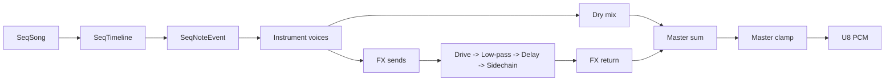

# Audio FX layer

## Goals
- Keep FX deterministic and lightweight.
- Keep one audio path (`SeqSong -> audio_mix_render_song -> U8 PCM`).
- Preserve retro/chiptune tone while adding dark synth/disco motion.

## FX bus model (`SeqFxBus`)

```c
typedef struct {
  int enabled;
  int delay_steps;
  int delay_feedback;
  int delay_mix;
  int drive_amount;
  int lowpass_amount;
  int sidechain_amount;
  int sidechain_release_ms;
  int mix_percent;
} SeqFxBus;
```

Notes:
- `delay_steps` is tempo-synced using song BPM and step resolution.
- `mix_percent` controls how much processed bus signal is summed back.
- Legacy 2-field bus initializers are normalized in mixer runtime.

## Signal flow



## Parameters

### Delay
- `delay_steps`: tempo-synced delay length (step units).
- `delay_feedback`: feedback percentage.
- `delay_mix`: wet/dry inside delay stage.

### Drive
- `drive_amount`: pre-gain plus soft saturation amount.

### Low-pass
- `lowpass_amount`: one-pole low-pass intensity (higher = darker).

### Fake sidechain
- `sidechain_amount`: ducking amount.
- `sidechain_release_ms`: envelope release back to unity.
- Triggered from step accents / `fx_trigger` activity routed to bus.

## Dark synth usage
- Route arp/pad/kick to one bus.
- Set delay to 2-4 steps, feedback ~25-40, mix ~20-35.
- Add drive ~15-30 for body.
- Use low-pass ~25-45 to darken repeats.
- Use sidechain amount ~30-50, release 120-220ms for disco pump.

## ABC optional directives
- `%%effect delay time=3 feedback=35 mix=25`
- `%%effect drive amount=20`
- `%%effect lowpass amount=35`
- `%%sidechain amount=40 release=180`

Unsupported directives remain safely ignored to preserve compatibility.
