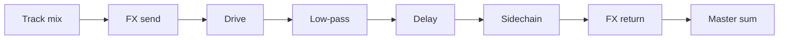

# Audio FX

`src/audio_fx.c` owns the bus FX layer used by the shared renderer.

## Responsibilities

- tempo-synced delay
- drive / saturation
- one-pole low-pass
- sidechain ducking
- clipping statistics helper used by render diagnostics

`src/audio_mix.c` does **not** implement FX processing logic. It only routes dry track output and FX sends/returns.

## Bus signal flow

## `SeqFxBus`

- `enabled`
- `delay_steps`
- `delay_feedback`
- `delay_mix`
- `drive_amount`
- `lowpass_amount`
- `sidechain_amount`
- `sidechain_release_ms`
- `mix_percent`

## Notes

- delay time is derived from BPM and steps-per-beat
- drive uses deterministic soft clipping
- sidechain is triggered from step accents / `fx_trigger`
- clipping diagnostics count sustained runs of `0` or `255`
- legacy single-bus directives still map to bus 0
