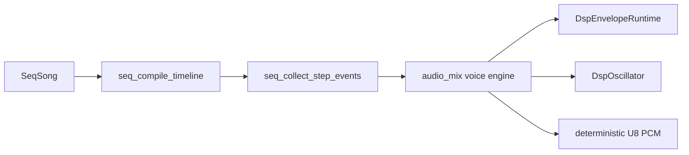
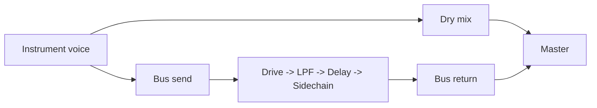

# Audio instruments

## Instrument model

The sequencer/mixer instrument model is `SeqInstrument` (`src/audio_seq.h`) with:

- waveform / optional noise mode
- amplitude
- pulse width
- ADSR envelope (`DspEnvelope`)
- detune (stacked voices)
- vibrato depth/rate
- PWM depth/rate
- glide/portamento
- FX send + accent gain

Built-in presets (`src/audio_song_builtin.c`):

- `memdeck_bass_pulse`
- `memdeck_dark_arp`
- `memdeck_soft_pad`
- `memdeck_brass_stab`
- `memdeck_lead`
- `memdeck_kick`
- `memdeck_hat`
- `memdeck_noise_snare`

## ADSR model

`DspEnvelope` (`src/audio_dsp.h`) is portable and deterministic:

- `attack_ms`
- `decay_ms`
- `sustain_level`
- `release_ms`
- `gate_percent`

Runtime states (`DspEnvelopePhase`):

- `idle`
- `attack`
- `decay`
- `sustain`
- `release`

Envelope progression is per-sample and driven by per-note events.

## Sequencing and rendering flow

## Dark synth / synth disco mapping

- Bass + arp presets use pulse, light detune, and PWM for retro motion.
- Lead/brass use faster attack and controlled vibrato for melodic shape.
- Drum presets use compact envelopes and optional noise for hats/snare.
- FX bus can add delay, drive, low-pass darkening, and fake sidechain pumping.

This model is intentionally lightweight and keeps the chiptune identity while enabling richer arrangement control.

## FX bus model (`SeqFxBus`)

- `enabled`
- `delay_steps`
- `delay_feedback`
- `delay_mix`
- `drive_amount`
- `lowpass_amount`
- `sidechain_amount`
- `sidechain_release_ms`
- `mix_percent`

Built-in dark synth routing uses this bus to process arp/pad/drum sends while keeping dry voices intact.

## Flow reminder

