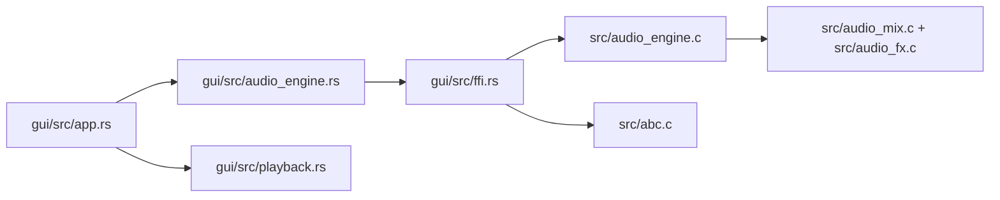

# MemDeck GUI Architecture (Rust + egui/eframe)

This GUI keeps MemDeck terminal-first while providing a polished read-only workstation shell for the showcase demos.

## Scope

### In scope
- demo browsing
- deterministic render triggering
- waveform / pattern inspection
- read-only instrument and FX inspection
- keyboard-first playback control

### Out of scope
- tracker editing
- piano roll editing
- arrangement editing
- DAW transport or timeline authoring
- rewriting the C engine in Rust

## Component map

## GUI-facing data model

`audio_engine.rs` now exposes:

- `DemoEntry`
- `DemoOverview`
- `TrackOverview`
- `FxBusOverview`
- `PatternBlock`
- `StepState`
- `RenderState`

The GUI reads these structs directly and does not mirror the same metadata in separate view-state copies.

## Runtime state ownership

`app.rs` owns only:

- selected demo index
- selected track index
- current focus area
- current rendered buffer for the selected demo
- current status line message

This keeps runtime state compact and avoids duplicated metadata/state drift.

## Playback architecture

Playback remains intentionally simple:

- render once
- wrap PCM into a temporary WAV
- spawn the platform player
- poll child process status
- expose progress for cursor drawing
- stop reliably on command or drop
