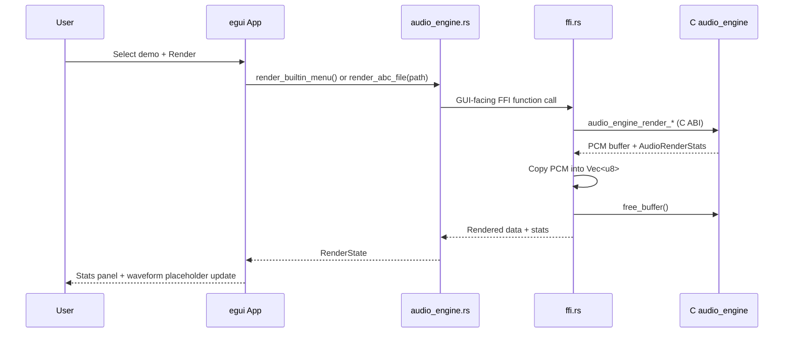

# MemDeck GUI Architecture (Rust + egui/eframe)

This document defines the first GUI foundation for MemDeck while preserving the existing C engine as the source of audio truth.

## Scope

- **In scope:** lightweight render-focused GUI shell, demo browsing, render triggering, render diagnostics, keyboard-first interaction.
- **Out of scope:** DAW behavior, timeline editing, tracker editor flows, piano-roll interactions, or any rewrite of the C DSP/sequencer engine.

## Architecture Goals

- Keep MemDeck **terminal-first**; GUI is an optional frontend.
- Reuse the portable C audio pipeline through FFI.
- Keep coupling minimal: GUI orchestrates render requests and displays metadata.
- Keep startup and runtime lightweight.

## Component Diagram

```mermaid
flowchart LR
    A[egui/eframe App Layer\n(gui/src/app.rs)] --> B[GUI Audio Adapter\n(gui/src/audio_engine.rs)]
    B --> C[FFI Bridge\n(gui/src/ffi.rs)]
    C --> D[C Audio Engine Facade\nsrc/audio_engine.c/.h]
    D --> E[ABC Parser\nsrc/abc.c]
    D --> F[Sequencer + Mixer + FX\nsrc/audio_seq.c + audio_mix.c + audio_fx.c]
    D --> G[Built-in Song Data\nsrc/audio_song_builtin.c]
```

## Render Flow



## Build and Linking

The `gui/build.rs` script compiles and links required C engine modules directly into the Rust binary using the `cc` crate.

- C sources included: `audio_engine.c`, `audio_mix.c`, `audio_seq.c`, `audio_dsp.c`, `audio_fx.c`, `audio_song_builtin.c`, `abc.c`, `card.c`
- Linked system libs: `ncursesw`, `m`

## FFI Surface (GUI-facing)

The GUI-facing API is exposed in `gui/src/ffi.rs`:

- `render_builtin_menu()`
- `render_abc_file(path)`
- `free_buffer()`
- `get_render_stats()`

These wrap C functions from `src/audio_engine.h`:

- `audio_engine_render_builtin_menu(...)`
- `audio_engine_render_abc_file(...)`
- `audio_engine_free_buffer(...)`

## Data Ownership

- C returns a heap PCM buffer.
- Rust copies PCM into `Vec<u8>`.
- Rust then calls `free_buffer()` to release C memory.
- Last render stats are cached on Rust side for panel display.

## UI Foundation Layout

- Left pane: demo list + actions.
- Right pane: render stats + waveform preview placeholder.
- Bottom bar: low-noise status feedback.

This establishes a minimal, extensible shell for future non-editor interactions without introducing DAW or tracker behaviors.
