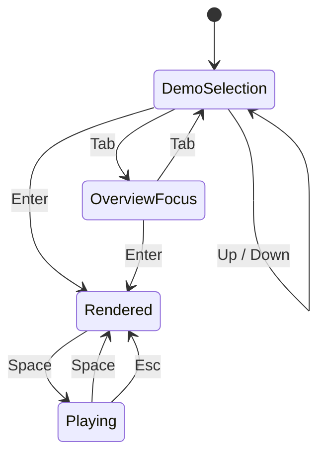

# MemDeck GUI Keybindings

## Runtime keys

| Key | Action |
| --- | --- |
| `Up` / `Down` | Select demo |
| `Enter` | Render selected demo |
| `Space` | Play or stop the current rendered demo |
| `Tab` | Switch focus highlight between demos and overview |
| `Esc` | Stop playback |

## Interaction model

## Design intent

- keyboard-first
- low cognitive load
- no mouse-heavy workflow
- no editing or DAW behavior
