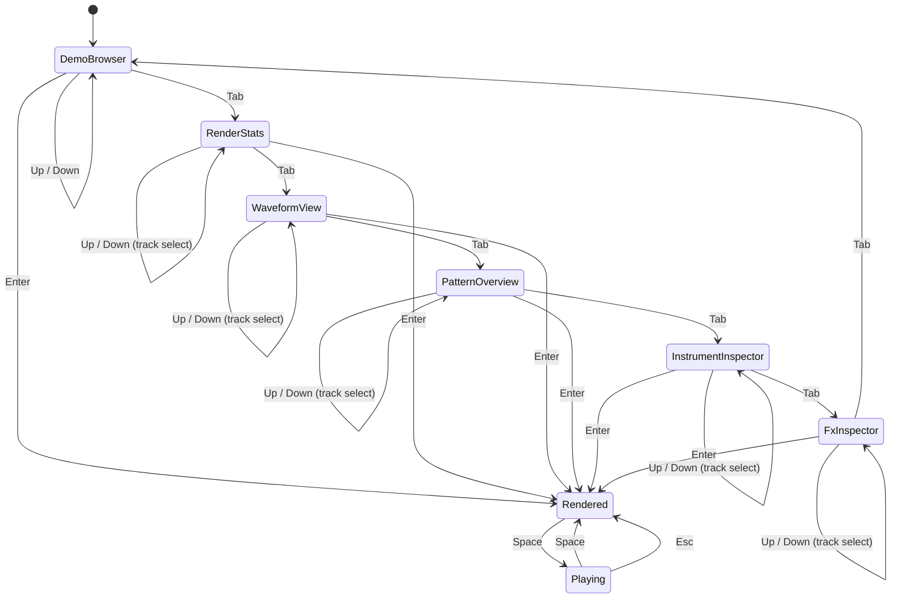

# MemDeck GUI Keybindings

## Required runtime keys

| Key | Action |
| --- | --- |
| `Up` / `Down` | Browse demos when Demo Browser is focused; otherwise change selected track |
| `Enter` | Render selected demo |
| `Space` | Start or stop playback |
| `Tab` | Cycle focus forward across all panels |
| `Shift+Tab` | Cycle focus backward across all panels |
| `Esc` | Stop playback |

## Direct panel focus

| Key | Panel |
| --- | --- |
| `D` | Demo Browser |
| `S` | Render Stats |
| `W` | Waveform |
| `P` | Pattern Overview |
| `I` | Instrument Inspector |
| `F` | FX Inspector |

## Interaction model

## Intent

- keyboard-first
- low cognitive load
- explicit status reporting
- read-only transport only
