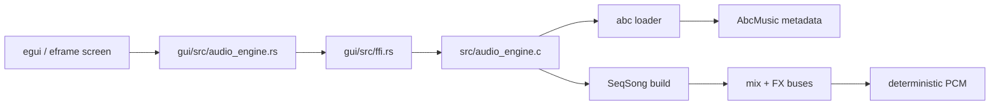

# MemDeck GUI Runtime

MemDeck's Rust GUI is a read-only runtime shell over the existing C renderer. It keeps the C engine as the source of truth for parsing, sequencing, FX, PCM generation, and deterministic render stats.

## Runtime architecture

## Runtime responsibilities

- `gui/src/ffi.rs` owns the unsafe boundary and metadata extraction.
- `gui/src/audio_engine.rs` exposes safe overview structs for demos, tracks, buses, and render output.
- `gui/src/playback.rs` wraps OS playback commands and reports process state + playback progress.
- `gui/src/app.rs` owns layout, focus flow, status messaging, and read-only panel rendering.

## Runtime flow

1. The app boots a fixed demo catalog from `data/music/*.abc`.
2. `abc_load` is used up front to build overview metadata for arrangement, tracks, and FX buses.
3. `Enter` renders the selected demo through `audio_engine_render_abc_file`.
4. Rust copies the PCM into owned GUI memory and caches the latest render stats.
5. `Space` writes the rendered PCM to a temporary WAV and delegates playback to the platform audio command.
6. The frame loop polls playback to update cursor position and stop/error state.

## Visible runtime states

The status line and stats panel always expose:

- selected demo
- selected track
- render readiness
- playback state
- render duration, sample count, clipping, peak, checksum
- parser/render/playback errors

## Stability rules

- the GUI stays read-only
- stop always tears down the child playback process and removes temporary WAV files
- repeated render/play/stop cycles reuse the same runtime shell without rebuilding the engine
- invalid demo files fail gracefully with visible status text instead of crashing the UI

## Screenshots

- Main runtime screen: `docs/screenshots/gui-runtime-main.png`
- Waveform + pattern focus: `docs/screenshots/gui-runtime-overview.png`
- Inspector focus: `docs/screenshots/gui-runtime-inspector.png`
