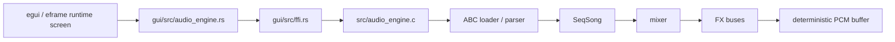
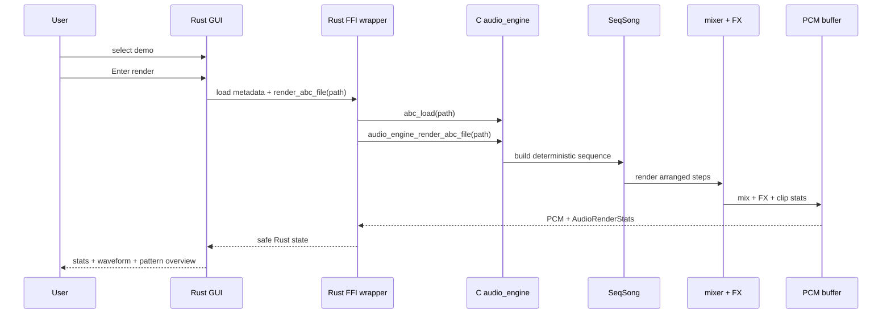

# MemDeck GUI Runtime

MemDeck's Rust GUI is a thin runtime shell over the existing C renderer. It stays read-only and keeps the C engine as the source of truth for demo parsing, sequencing, mixing, FX, and deterministic PCM generation.

## Runtime architecture

## Runtime flow

## Stable runtime responsibilities

- `gui/src/ffi.rs` contains the unsafe boundary.
- `gui/src/audio_engine.rs` exposes safe demo metadata and render helpers.
- `gui/src/playback.rs` handles simple OS-level playback of rendered WAV output.
- `gui/src/app.rs` owns the one-screen keyboard-first runtime UI.

## Runtime feedback

The runtime screen shows:

- render duration
- sample count
- clipping count
- peak level
- checksum
- render state
- invalid ABC/load failures

## Screenshots

- Main runtime screen: `docs/screenshots/gui-runtime-main.png`
- Waveform / pattern overview: `docs/screenshots/gui-runtime-overview.png`
