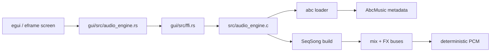

# MemDeck GUI Runtime

MemDeck's Rust GUI is an editable shell over the existing C renderer. The C engine remains the source of truth for parsing, sequencing, FX, PCM generation, and deterministic render stats.

## Runtime architecture

## Runtime responsibilities

- `gui/src/ffi.rs` owns the unsafe boundary and metadata extraction.
- `gui/src/audio_engine.rs` exposes safe overview structs for demos, tracks, buses, and render output.
- `gui/src/playback.rs` streams rendered PCM to the host output device with `cpal` and reports playback state + progress.
- `gui/src/app.rs` owns layout, focus flow, mode transitions, status messaging, and editor synchronization.

## Runtime flow

1. The app boots a fixed demo catalog from `data/music/*.abc`.
2. Browser mode uses overview metadata for read-only inspection.
3. Edit mode loads/creates an `EditableSong` for arrangement/pattern/inspector edits.
4. Editable songs default to user storage under `~/.local/share/memdeck/music/user/` (`XDG_DATA_HOME` + `MEMDECK_USER_SONG_DIR` aware).
5. Dirty-state guards block destructive transitions (open/new/duplicate/close/quit) until Save/Discard/Cancel is resolved.
6. Preview renders editable content through `EditableSong -> ABC DSL -> C engine -> PCM`.
7. `Space` streams rendered PCM directly through the in-process `cpal` playback backend.
8. The frame loop polls playback to update cursor position and stop/error state.

## Related ADRs

- `docs/adr-0001-gui-direct-audio-playback.md`

## Visible runtime states

The status line always exposes:

- current mode
- selected song
- selected pattern
- selected track
- focused panel
- dirty state
- render readiness
- playback state
- current song path
- last error

## Stability rules

- stop always tears down the active audio stream and resets playback runtime state
- repeated render/play/stop cycles reuse the same runtime shell without rebuilding the engine
- invalid demo files fail gracefully with visible status text instead of crashing the UI
- edit operations in Preview mode invalidate stale editable render state and return to Edit mode

## Screenshots

- Browser mode: `docs/screenshots/gui-browser-mode.png`
- Edit arrangement mode: `docs/screenshots/gui-edit-mode-arrangement.png`
- Preview mode: `docs/screenshots/gui-preview-mode.png`
