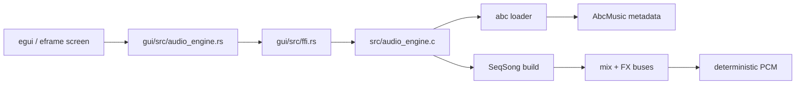

# MemDeck GUI Runtime

MemDeck's Rust GUI is an editable shell over the existing C renderer. The C engine remains the source of truth for parsing, sequencing, FX, PCM generation, and deterministic render stats.

## Runtime architecture

## Runtime responsibilities

- `gui/src/ffi.rs` owns the unsafe boundary and metadata extraction.
- `gui/src/audio_engine.rs` exposes safe overview structs for demos, tracks, buses, and render output.
- `gui/src/playback.rs` wraps OS playback commands and reports process state + playback progress.
- `gui/src/app.rs` owns layout, focus flow, mode transitions, status messaging, and editor synchronization.

## Runtime flow

1. The app boots a fixed demo catalog from `data/music/*.abc`.
2. Browser mode uses overview metadata for read-only inspection.
3. Edit mode loads/creates an `EditableSong` for arrangement/pattern/inspector edits.
4. Preview renders editable content through `EditableSong -> ABC DSL -> C engine -> PCM`.
5. `Space` writes rendered PCM to a temporary WAV and delegates playback to the platform audio command.
6. The frame loop polls playback to update cursor position and stop/error state.

## Visible runtime states

The status line always exposes:

- current mode
- selected song
- selected pattern
- selected track
- focused panel
- dirty state
- render readiness
- playback state
- last error

## Stability rules

- stop always tears down the child playback process and removes temporary WAV files
- repeated render/play/stop cycles reuse the same runtime shell without rebuilding the engine
- invalid demo files fail gracefully with visible status text instead of crashing the UI
- edit operations in Preview mode invalidate stale editable render state and return to Edit mode

## Screenshots

- Browser mode: `docs/screenshots/gui-browser-mode.png`
- Edit arrangement mode: `docs/screenshots/gui-edit-mode-arrangement.png`
- Preview mode: `docs/screenshots/gui-preview-mode.png`
