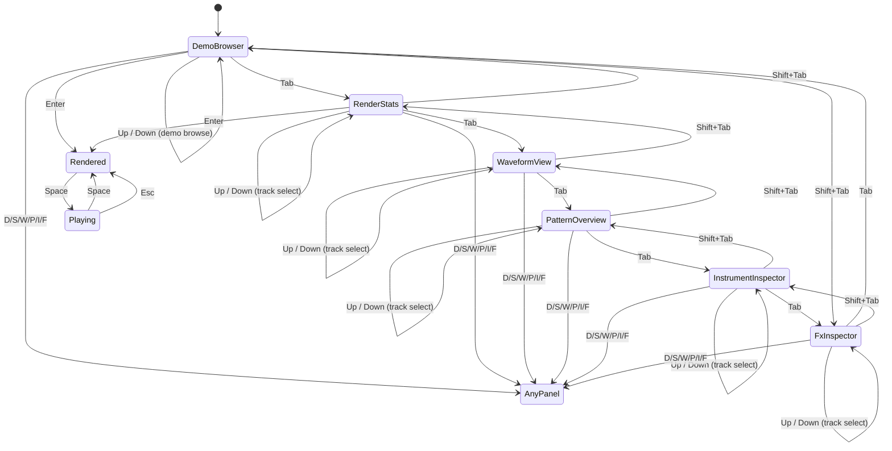
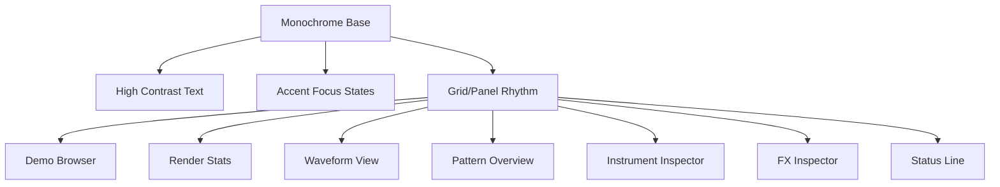

# MemDeck GUI UX Principles

This document defines the initial UX strategy for the MemDeck GUI foundation.

## Design Direction

The GUI follows a strict retro-tool direction inspired by Atari ST-era sound tools and tracker minimalism:

- Dark monochrome palette
- Strong panel/grid structure
- Keyboard-first interaction model
- Low cognitive load
- Minimal ornamentation and no glossy modern styling

## Experience Principles

### 1. Terminal-first compatibility
The GUI is an optional layer over the C engine; it must not displace terminal workflows.

### 2. One-screen clarity
The initial foundation keeps all critical actions on one screen:

- choose demo
- render
- inspect stats
- see waveform and pattern overview

No mode-heavy navigation or hidden interaction trees.

### 3. Keyboard as primary input
Required keys are first-class and always available:

- Up/Down: navigate list/actions
- Enter: execute focused action
- Space: play placeholder action
- Tab: switch focus region
- Esc: clear status or close

### 4. Progressive disclosure
Only render-relevant controls are visible. Editor/timeline concepts are intentionally absent.

### 5. Deterministic feedback
Every render action updates a clear status line and a stable stats panel to reduce ambiguity.

## Interaction Model

## Visual System Foundations

## Non-Goals (Explicit)

The GUI foundation explicitly excludes:

- DAW timeline behavior
- piano-roll editing
- tracker step editing
- sequencing/editor workflows
- audio engine rewrite in Rust
- Tauri stack adoption

## Quality Bar for the Foundation

- Fast launch
- Minimal visual noise
- Predictable key behavior
- Stable render stats visibility
- Safe memory lifecycle across C FFI boundary
